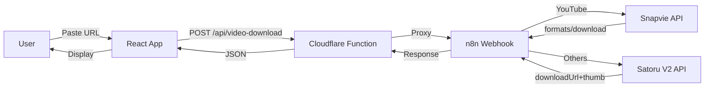

# TaiVideo - System Architecture

## Overview
**TaiVideo** (taivideo.huphet.vn) là ứng dụng tải video đa nền tảng, hỗ trợ YouTube, TikTok, Facebook, Instagram, Shopee, Douyin và nhiều nền tảng khác.

## Tech Stack
| Layer | Technology |
|-------|-----------|
| Frontend | React + TypeScript + Vite |
| Styling | TailwindCSS |
| Hosting | Cloudflare Pages |
| Backend Proxy | Cloudflare Functions (`functions/api/video-download.ts`) |
| Workflow Engine | n8n (self-hosted tại `auto.myphamhaki.vn`) |
| Video APIs | Snapvie (YouTube), Satoru V2 (TikTok/FB/IG/others) |

## Architecture Flow

## Key Components

### Frontend (`src/`)
- **`App.tsx`** — Main orchestrator. Handles download flow, affiliate tracking, streaming result updates
- **`components/ResultList.tsx`** — Renders download results + QualitySelector for YouTube
- **`services/geminiService.ts`** — URL analysis, platform detection, instant thumbnail extraction
- **`services/n8nService.ts`** — API communication: `fetchDownloadLink`, `fetchFormats`, `fetchDownloadWithFormat`, `enrichResultWithDownload`

### Backend Proxy (`functions/`)
- **`api/video-download.ts`** — Cloudflare Function proxying requests to n8n webhook

### n8n Workflow
- **`Web Video Download API V3.json`** — Main workflow with routing logic:
  - YouTube → **Snapvie All-in-One** node (2-phase: extract + download with muxing)
  - Others → **Satoru V2** node (single-phase: instant download)

## YouTube 2-Phase Download Flow
1. **Phase 1 (Extract)**: Frontend sends `phase: 'extract'` → n8n → Snapvie `/api/proxy/extract` → returns formats list + metadata
2. **User selects quality** via QualitySelector grid
3. **Phase 2 (Download)**: Frontend sends `phase: 'download'` + `video_format_id` → n8n → Snapvie prepare + mux → polling for download URL (up to 5 minutes)

## Deployment
- **Auto-deploy**: Push to `main` → Cloudflare Pages builds → deployed to `taivideo.huphet.vn`
- **n8n Workflow**: Manual import of `Web Video Download API V3.json` into n8n instance
- **Domains**: `tai-video.pages.dev`, `taivideo.huphet.vn`
